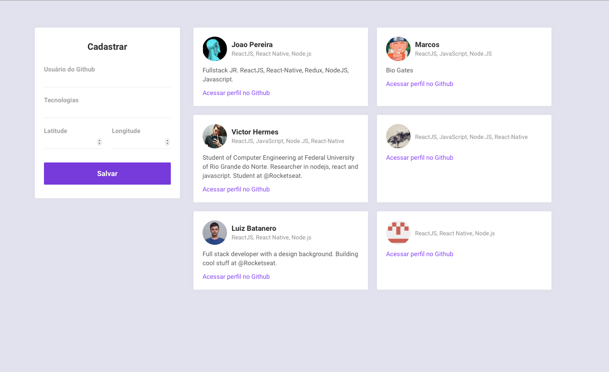
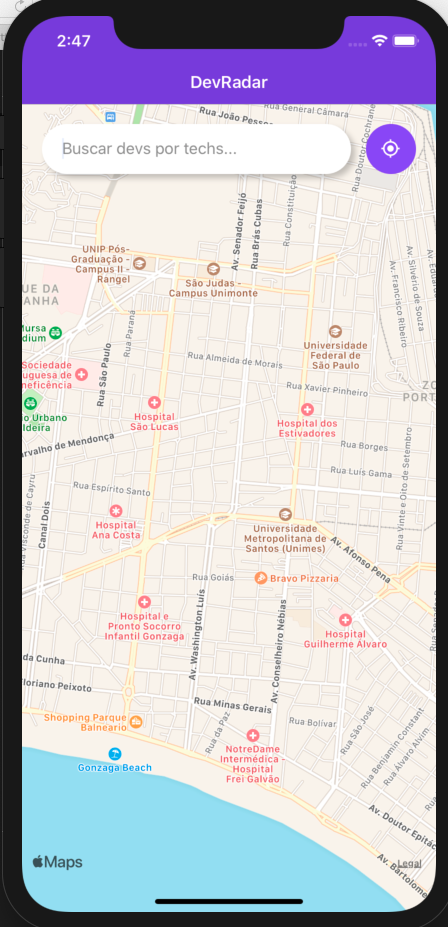

<h1 align="Left" >Omnistack10</h1>
<p align="left">Projeto OmnistackWeek10 desenvolvido durante a 10ª edição da semana Omnistack da <a href="https://rocketseat.com.br">Rocketseat</a></p>

## Backend


- Axios
- Cors
- Mongoose
- PostgreSQL
- Sequelize
- Socket.io
- Eslint
- Prettier
- Nodemon

## Frontend

- Axios
- React
- Eslint
- Prettier

## Mobile

- Axios
- Expo
- Socket.io
- React-Native
- Eslint
- Prettier

**Imagem Web**

<p align="center">

</p>

**Imagem Mobile**

<p align="center">

</p>


### Instalando
**Clone o Repositório**

```
git clone git@github.com:JoaoVitorSPereira/OmnistackWeek10.git

cd OmnistackWeek10
```

**Instale as dependências com NPM ou Yarn**

```
npm install
//ou
yarn
```

**Rode `npm start` no terminal para iniciar o servidor (modo desenvolvimento), em seguida acesse a porta 3000 no navegador.**

**Rode `npm start` no terminal para iniciar o site Web, que abrira sozinho apos execução**

**Rode `expo start` no terminal para iniciar o mobile.**
## Licença
Este projeto está licenciado sob a licença [MIT](./LICENSE) &copy; [Rocketseat](https://rocketseat.com.br/).